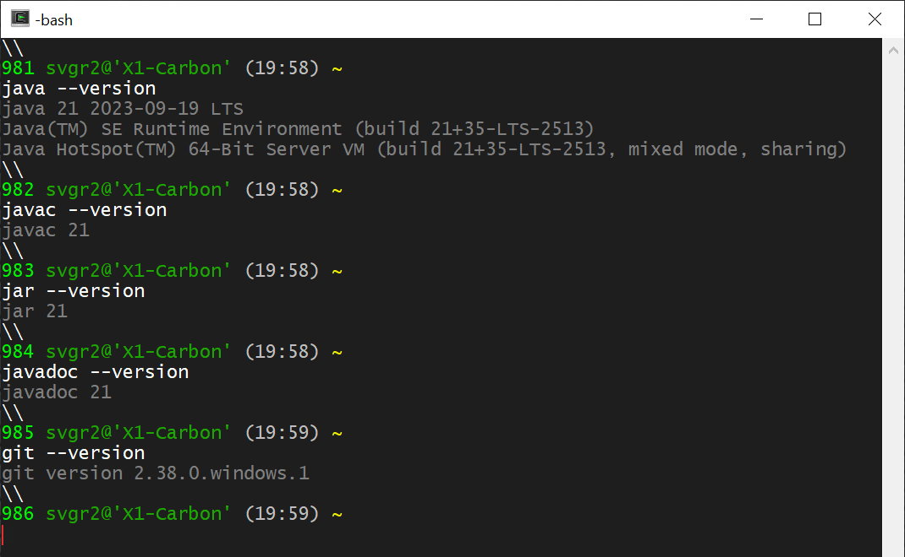
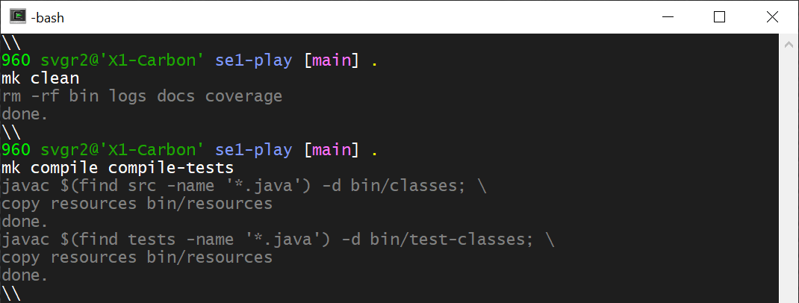
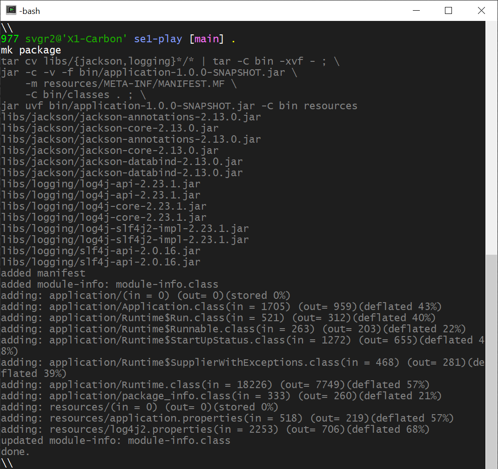
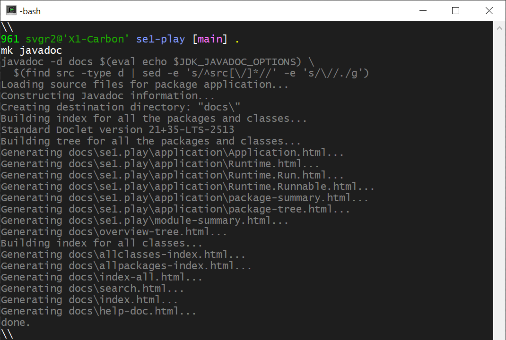
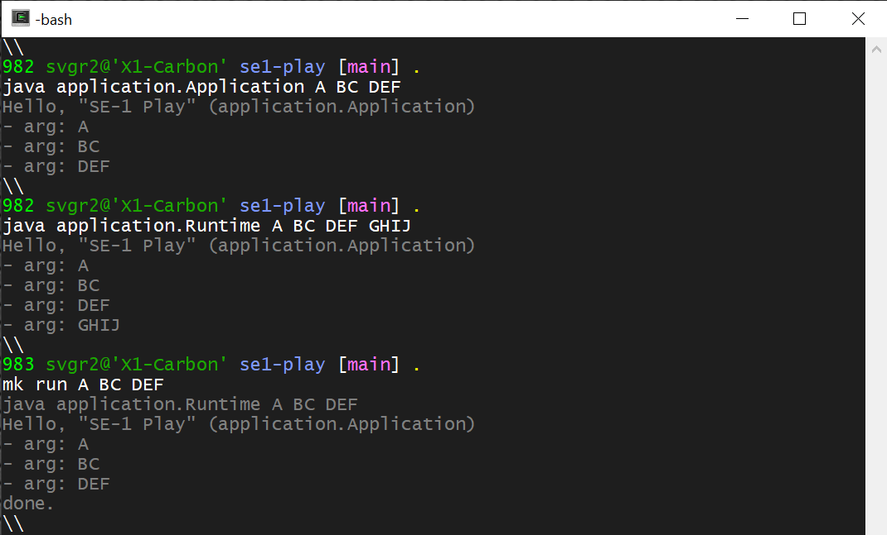
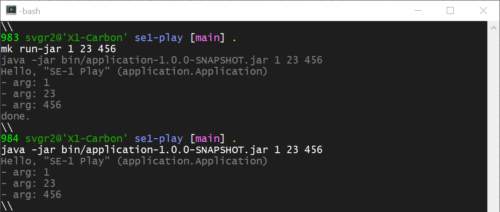

# Aufgabe A2: *Projekt Installation, Setup und Bau*
`10 Punkte`

Voraussetzungen für die Übung ist, dass Sie aus
[*Übung A1*](A1-JDK-und-Terminal.md)
eine korrekte Terminalkonfiguration, eine IDE (*VSCode*, *eclipse* oder *IntelliJ*)
sowie das `Java JDK` (Version 21 oder höher) installiert haben.

Prüfen Sie bitte diese [Voraussetzungen](#voraussetzungen) als ersten Schritt.

Lesen Sie die Einführung in das Projekt
[*"se1-play"*](https://github.com/sgra64/se1-play)
und führen Sie die beschriebenen Schritte aus für:

- Installation des Projekts (*Getting the project*),

- Projekt *Setup* und

- Projekt *Build*.

Demonstrieren Sie am Ende in der Übung, dass Sie das Projekt korrekt
*"installiert"* und *"gebaut"* haben und Sie die folgenden Aufgaben
in der IDE und im Terminal ausführen können.

1. Zeigen Sie den *Bau des Projekts* (*"project build"*) mit:

    - [[1 Pkt]](#compilieren) - Compilieren des Quellcodes und der Tests,

    - [[1 Pkt]](#ausführung-der-tests-im-terminal) - Ausführung der Tests im Terminal,

    - [[1 Pkt]](#paketieren-als-jar) - Paketierung in ein ausführbares (auslieferbares) `.jar`
        als Endprodukt des *Build*-Prozesses,

    - [[1 Pkt]](#erzeugung-der-javadoc) - Erzeugung der *Javadoc*.

1. Zeigen Sie die Programm- und Test-Ausführung in der IDE:

    - [[1 Pkt]](#ausführung-des-programms-und-der-tests-in-der-ide) - Programmausführung
        in der IDE,

    - [[1 Pkt]](#ausführung-des-programms-und-der-tests-in-der-ide) - Ausführung des Tests
        in der IDE.

1. Zeigen Sie im Terminal:

    - [[1 Pkt]](#programmausführung-im-terminal) - die Ausführung des Programms
        im Terminal,

    - [[1 Pkt]](#ausführung-des-jar) - die Ausführung des paketierten `.jar`.

    - [[1 Pkt]](#ändern-der-konfiguration) - Änderung der Konfiguration
        der `application.name` Property.

    - [[1 Pkt]](#ausgabe-des-runtime-logs) - Geben Sie den *Runtime* `log` aus.

1. [[Abnahme]](#abnahme-in-der-übung) in der Übung.


---

&nbsp;

## Voraussetzungen

Öffnen Sie ein Terminal und führen Sie die folgenden Kommandos aus:

```sh
java --version              # Anzeige der Java Version (21 oder höher)
javac --version             # Anzeige der Version des Java Compilers
jar --version               # Version des Java-Archivers
javadoc --version           # Version des Javadoc-Compilers
git --version               # Version von git
```

Ausgaben im Terminal:




&nbsp;

## Compilieren

Zum *Build Prozess* gehört das *Compilieren des Quellcodes*, welches der
*Java Compiler* `javac` ausführt. Die IDE compiliert im Hintergrund, so dass
dieser Schritt in der IDE nicht sichtbar wird.

Führen Sie die Schritte aus:

```sh
mk clean                    # Entfernen aller vorher generierten Artefakte
mk compile                  # Compilieren der Quellcodes aus 'src'
mk compile-tests            # Compilieren der Tests aus 'tests'

mk clean compile compile-tests      # Schritte zusammengefasst
```

Die Ausgaben zeigen die Aufrufe des Java-Compilers `javac` in der `mk` (*"make"*)
Funktion, die als Ergebnis des *"Sourcings"* verwendet werden kann.



Alternativ kann man `javac` auch direkt aufrufen:

```sh
javac $(find src -name '*.java') -d bin/classes; \
copy resources bin/resources
```


&nbsp;

## Ausführung der Tests im Terminal

Die Ausführung der *JUnit-Tests* (hier nur eine Testklasse:
[Application_0_always_pass_Tests.java](https://github.com/sgra64/se1-play/tree/main/tests/application),
die stets passiert, um das Testsystem in der IDE und im Terminal zu prüfen).

Zur Ausführung der Tests im Terminal wird ein *"Test-Runner"* benötigt
(`junit-platform-console-standalone-1.9.2.jar`), der mit anderen Bibliotheken
mit dem [*libs*](https://github.com/sgra64/se1-play/tree/libs) - Branch
in das Projekt eingebaut wurde.

Führen Sie die *JUnit-Tests* im Terminal aus:

```sh
mk run-tests                # Ausführung der JUnit-Tests
```

Ausgabe:


Auch hier sehen Sie den von der `mk` Funktion vermittelten Aufruf
des *"Test-Runners"*, der auch nur eine paketierte Java-Anwendung
ist und mit `java` ausgeführt wird:

```sh
# eigentliche Ausführung des Test-Runners
java -jar ./libs/junit-platform-console-standalone-1.9.2.jar \
  $(eval echo $JUNIT_OPTIONS) \
  --scan-class-path
```


&nbsp;

## Paketieren als *.jar*

Als *"Paketieren"* (*"packaging"*) bezeichnet man das Verpacken
des übersetzten Codes in ein auslieferbares Endprodukt (*final
artefact*), bei Java ist das ein `.jar` File (Java-Archive,
ähnlich wie ein `.tar` oder `.zip`).

Das *"Paketieren"* wird mit dem Java-Archiver `jar` ausgeführt:

```sh
mk package                  # Paketieren in Endprodukt
```

Ausgabe:



Die Ausgabe zeigt das Verpacken des übersetzten Code aus dem
Verzeichnis `bin/classes`, sowie der mit auszuliefernden
Konfigurationsdateien in `bin/resources` und das Verpacken der
aus dem
[*libs*](https://github.com/sgra64/se1-play/tree/libs) - Branch
im Projekt installierten Bibliotheken.


&nbsp;

## Erzeugung der *Javadoc*

*Javadoc* ist eine mit dem `javadoc`-Compiler aus dem Quellcode
generierte Dokumentation, die als HTML/(Web-) Seite erstellt wird.

Der Aufruf des `javadoc`-Compilers:

```sh
mk javadoc                  # Generierung der Javadoc
```

Ausgabe:



Das erzeugte HTML befindet sich in einem neuen Verzeichnis `docs`
im Projektverzeichnis.

```sh
mk javadoc                  # Generierung der Javadoc
ls -la
...
drwxr-xr-x 1 svgr2 Kein     0 Oct  5 14:01 docs
...
```

In `docs` befindet sich die Datei `index.html`, die Sie in einem
Browser aufrufen können. Die Javadocs werden im Browser angezeigt:


Sie können im HTML navigieren, z.B. wenn Sie das Paket `application`
klicken.


&nbsp;

## Ausführung des Programms und der Tests in der IDE

Eine IDE dient primär der Programmentwicklung (Editieren, Debuggen, etc.).
Nicht alle Aufgaben des *Build*-Prozesses sind in der IDE ausführbar.

In der IDE müssen das Programm und die Unit-Tests ausführbar sein.

Dafür muss in *VSCode* das
[*Extension Pack for Java*](https://marketplace.visualstudio.com/items?itemName=vscjava.vscode-java-pack)
installiert sein, das auch den *Test Runner* mit enthält.

Zur Programmausführung öffnet *VSCode* ein Terminal und führt den zum
Start (*launch*) konfigurierten Aufruf aus.
Diese Konfigurationen sind im Projekt-Verzeichnis in
[.vscode](https://github.com/sgra64/se1-play/tree/main/.vscode)
und darin in
[launch.json](https://github.com/sgra64/se1-play/blob/main/.vscode/launch.json)
für *Run & Debug* bzw. für den (separat zu installierenden)
*Java Coderunner* in
[settings.json](https://github.com/sgra64/se1-play/blob/main/.vscode/settings.json)
enthalten.

Die Ausführung des Programms und der JUnit-Tests in *VSCode* (Klicken
Sie zur Test-Ausführung auf das Reagenzglas links):


Auch in anderen IDE können das Programm und die JUnit-Tests ausgeführt
werden.


&nbsp;

## Programmausführung im Terminal

Die Programmausführung im Terminal kann auf verschiedenen Wegen ausgelöst
werden.

```sh
java application.Application A BC DEF       # direkter Start

java application.Runtime A BC DEF GHIJ      # Start über Runtime

mk run A BC DEF                             # Programmausführung über die mk()-Funktion
```

Die Ausgabe des Programms ist der aus
[resources](https://github.com/sgra64/se1-play/blob/main/resources)/[application.properties](https://github.com/sgra64/se1-play/blob/main/resources/application.properties)
aus der Property: `application.name` ausgelesene Programm-Name: *"SE-1 Play"*
sowie die Ausgabe der in der Kommandozeile übergebenen `args[]`, im Beispiel:
`A BC DEF`.

```
Hello, "SE-1 Play" (application.Application)
- arg: A
- arg: BC
- arg: DEF
done.
```




&nbsp;

## Ausführung des *.jar*

Auch das paketierte Endprodukt des *Build*-Prozesses:
`application-1.0.0-SNAPSHOT.jar`, das sich im `bin`
Verzeichnis befindet, kann auf verschiedenen Wegen
ausgeführt werden.

```sh
mk run-jar 1 23 456         # Programmausführung über die mk()-Funktion

# direkte Ausführung des paketierten Programms
java -jar bin/application-1.0.0-SNAPSHOT.jar 1 23 456
```

Ausgabe:

```
Hello, "SE-1 Play" (application.Application)
- arg: 1
- arg: 23
- arg: 456
done.
```




&nbsp;

## Ändern der Konfiguration

Der Name des Programms wurde nicht im Java-Code festgeschrieben
(*hard-wired*).
Er könnte in der ausgelieferten, paketierten Variante dann nicht
mehr geändert werden.

Sollen Endkunden, die nur die paketierten Variante des Programms
erhalten und keine Quellcode-Änderung ausführen können,
Parameter einstellen (konfigurieren) können, werden diese
Parameter in Konfigurationsdateien zusammengefasst.

Die Konfigurationsdateien werden mit dem Endprodukt ausgeliefert,
z.B. als Teil der `.jar`.

Komplexere Frameworks, wie
[Spring Boot](https://spring.io/projects/spring-boot),
verwenden dafür
[resources](https://github.com/sgra64/se1-play/blob/main/resources)/[application.properties](https://github.com/sgra64/se1-play/blob/main/resources/application.properties).

Im Projekt *se1-play* wird dieses nachgebaut und das Einlesen der Datei
durch
[Runtime.java](https://github.com/sgra64/se1-play/tree/main/src/application)
im Paket `application` realisiert.

Ändern Sie den Programm-Namen auf: `SE-1 Play, version 1.0.0` und
führen Sie das (unveränderte) Programm erneut aus:

```sh
mk run
```

Die Ausgabe zeigt den neuen Namen mit Versionsnummer:

```
java application.Runtime
Hello, "SE-1 Play, version 1.0.0" (application.Application)
done.
```


&nbsp;

## Ausgabe des Runtime logs

Die internen Aktivitäten eines Programms werden in professionellen
Softwaresystemen heute umfangreich aufgezeichnet (*gelogged*).

Dazu werden komplexe Logging-Systeme verwendet. Im Projekt wurde
über den
[*libs*](https://github.com/sgra64/se1-play/tree/libs) - Branch
ein Logging System bestehend aus
[*slf4j*](https://www.slf4j.org/)
(Standard-Fasade für Logging) und
[*log4j2*](https://logging.apache.org/log4j/2.12.x/)
(weit verbreitete Implementation der Fasade)
mit in das Projekt eingebaut, dessen Konfiguration über
[resources](https://github.com/sgra64/se1-play/blob/main/resources)/[log4j2.properties](https://github.com/sgra64/se1-play/blob/main/resources/log4j2.properties)
erfolgt.

Logs werden über Logger (Objekte) geschrieben, die Methoden für Log-Nachrichten
haben, wie `info(...)`, `warn(...)` oder `error(...)`.

Die Klasse
[Runtime.java](https://github.com/sgra64/se1-play/blob/main/src/application/Runtime.java)
verwendet ein Logger-Objekt: `log` und schreibt während der Programmausführung
entsprechende Einträge, wie z.B.:

```java
if(runnable.isPresent()) {
    log.info(String.format("runnable instance created: \"%s\"", runnable.get().getClass().getName()));
    log.info(String.format("runnable instance started: \"%s%s\"",
        runnable.get().getClass().getName(), ".run(properties, args[])"));
    //
    runnable.get().run(properties, args);
} else {
    log.warn(String.format("no runnable instance created"));
    log.warn("no runnable instance: must have at least one class on CLASSPATH");
    log.warn("that implements the Runtime.Runnable interface");
};
```

Für das Logger-Objekt der Klasse `Runtime.java` wurde in
[log4j2.properties](https://github.com/sgra64/se1-play/blob/main/resources/log4j2.properties)
ein Rolling-File-Appender konfiguriert, der log-Ausgaben dieser Klasse in eine Datei
`runtime.log` in ein Verzeichnis `logs` schreibt.

Geben Sie den Log aus, der interne Aktivitäten der Klasse `Runtime.java` während
der Programmausführung akkumulierend aufzeichnet:

```sh
cat logs/runtime.log
```

Ausgabe:

```
[INFO ] 2024-10-05 22:07:11.688 [main] Runtime - ------------ starting: application.Runtime
[INFO ] 2024-10-05 22:07:11.702 [main] Runtime - loaded 4 properties from: "resources/application.properties"
[INFO ] 2024-10-05 22:07:11.703 [main] Runtime - loaded logger configuration from: "resources/log4j2.properties"
[INFO ] 2024-10-05 22:07:11.703 [main] Runtime - Runtime.started
[INFO ] 2024-10-05 22:07:11.708 [main] Runtime - found 16 resources in filesystem
[INFO ] 2024-10-05 22:07:11.716 [main] Runtime - 2 runnable classes found
[INFO ] 2024-10-05 22:07:11.722 [main] Runtime - runnable instance created: "application.Application"
[INFO ] 2024-10-05 22:07:11.722 [main] Runtime - runnable instance started: "application.Application.run(properties, args[])"
[INFO ] 2024-10-05 22:07:11.726 [main] Runtime - Runtime.shuttingDown
[INFO ] 2024-10-05 22:07:11.726 [main] Runtime - Runtime.shutDown ------------
...
```

In professioneller Software sind keine `System.out.println(...)` enthalten,
dafür werden umfangreiche Logs aufgezeichnet.

Die `Runtime` eines Programms stellt stets ein logging System bereit.

Das in Java enthaltene `java.util.logging` (JUL) - Paket ist leider nicht
zu den lange etablierten Standards konform und wird daher in der Praxis
kaum verwendet.


&nbsp;

## Abnahme in der Übung

Sie können in der Übung die einzelnen Punkte auf Ihrem Laptop zeigen.

Wenn **alle** Funktionen korrekt funktionieren, können Sie folgende Kommandos
für die beschleunigte Abnahme in der Übung vorbereiten:

- In der IDE zeigen Sie bitte die Ausführung des Programms und der JUnit-Tests,
    wie [*hier*](#ausführung-des-programms-und-der-tests-in-der-ide) gezeigt.

- Im Terminal führen Sie den *Build-Prozess* erneut komplett aus:
    ```sh
    wipe                    # Entfernen aller alten Artefakte
    source .env.sh          # erneutes Sourcen des Projekts

    # complete project rebuild
    mk compile compile-tests run-tests package javadoc

    # run created final arefact
    java -jar bin/application-1.0.0-SNAPSHOT.jar \
        "Müller, Lena" \
        "Meyer, Eric" \
        "Blumenfeld, Nadine-Ulla"

    # show run-time log
    cat logs/runtime.log
    ```

- Zeigen Sie die neu generierten *Javadoc* im Browser wie
    [*hier*](#erzeugung-der-javadoc) gezeigt.

Der [komplette Log](A2-Aufgaben.log) der Ausführung.
