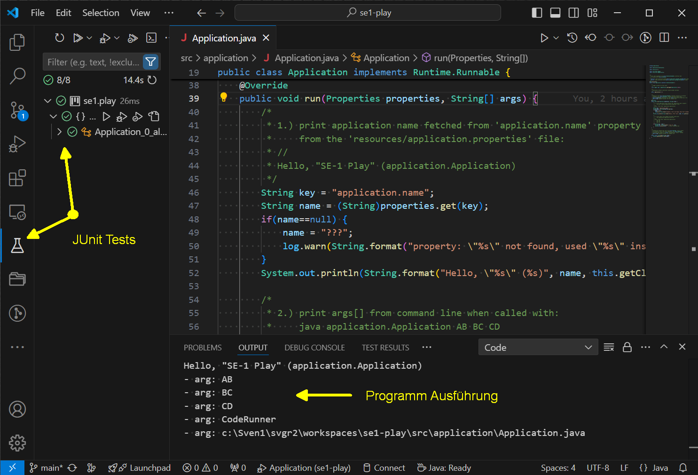
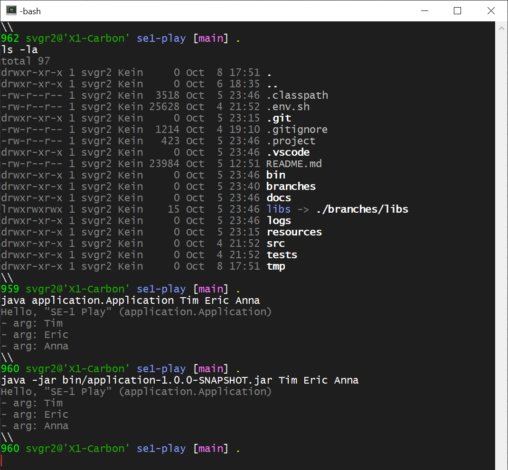
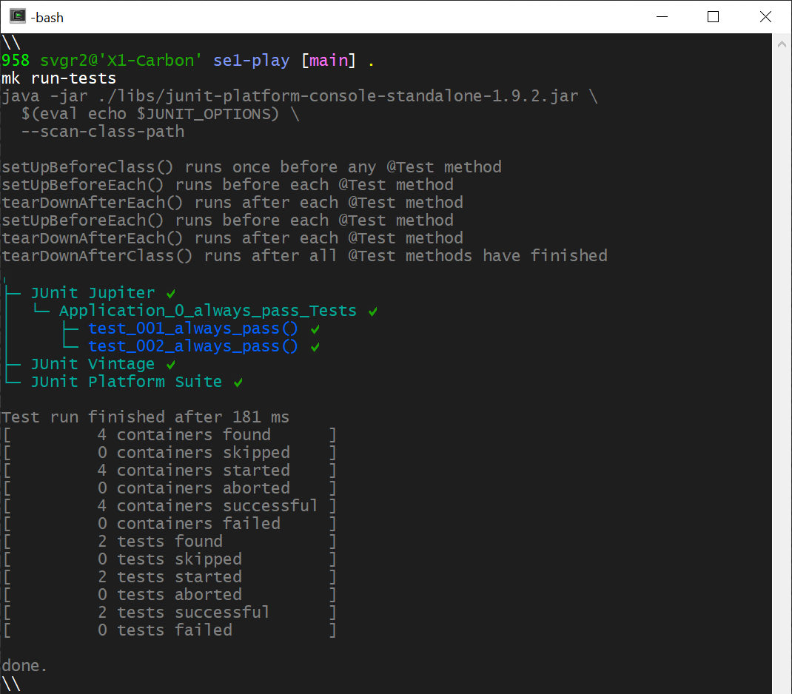
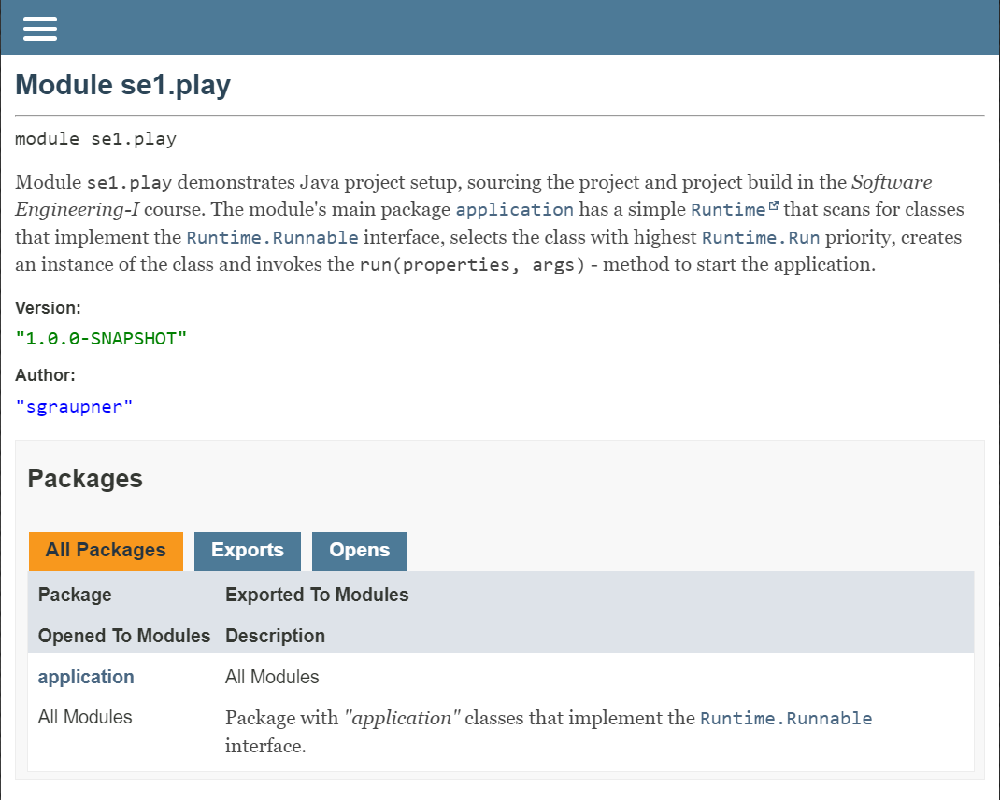

# Übungen: *A1*, *A2* und *A3*

*Software Engineering* geht über die Programmierung hinaus und betrachtet
alle Aspekte der Planung, Entwicklung und Organisation von Software-Projekten,
von der ersten Idee bis zum ablaufenden Produktivsystem (über alle Phasen
des Lebenszyklus eines Software Produkts).

- Ein *Software Projekt* (übergeordnet) ist eine Unternehmung, die der
    *Entwickler* und andere beteiligte Rollen in einem Zeitraum mit
    verfügbaren Ressourcen ein vorgesehenes Ziel (Anforderungen) mit
    bewährten (ingenieursgemäßen) Methoden, Strukturen und Prozessen
    zu erreichen versuchen.

- Ein *Software Projekt* (technisch) ist die Organisationsform von Quellcode
    und aller weiter benötigten Software-Artefakten (Bibliotheken, Werkzeuge,
    Konfigurationen usw.), die für die Entwicklung, Verwaltung und Auslieferung
    der Software erforderlich sind.

- Ein *ingenieursgemäß* organisiertes *Software Projekt* besitzt:

    - eine klare Struktur der Dinge (Artefakte, Dateien, Verzeichnisse für
        Quellcode, Konfigurationen, Zwischenstände, Bibliotheken, Werkzeuge) und

    - eine klare Struktur der Vorgänge und Prozesse, u.a. für *Installation*,
        *Setup*, *Build*, *Test*, *Release* (Auslieferung), *Integration*,
        *Deployment* usw.

Ziel der Übungen ist, ein Verständnis und praktische Fähigkeiten dafür
zu vermitteln.

Als Beispiel dient das Projekt:
[*"se1-play"*](https://github.com/sgra64/se1-play).

Für die Übungen führen Sie bitte die folgenden Aufgaben (*A1, A2*)
aus und beantworten Sie anschliessend die Fragen (*A3*).

- [A1-JDK-IDE-Terminal-setup](A1-JDK-IDE-Terminal-setup.md)

    - *Java Development Kit (JDK), Version 21 (LTS)* oder höher,

    - *Integrated Development Environment (IDE)* - *VSCode*, *eclipse*, *IntelliJ*.

    - *Terminalsoftware* mit Grundverständnis für:

        - *Terminal* und *Shell*, [*link*](https://github.com/sgra64/markup/blob/main/terminal/01-terminal-and-shell.md).

        - *Filesystem* und *$HOME directory*, [*link*](https://github.com/sgra64/markup/blob/main/terminal/02-filesystem-and-home.md).

        - *Prozesse" und *Umgebungs-Variables*, [*link*](https://github.com/sgra64/markup/blob/main/terminal/03-processes-and-environment.md).

        - *Dotfiles*, [*link*](https://github.com/sgra64/markup/blob/main/terminal/04-dotfiles.md).

        - *Aliases* und *Funktionen*, [*link*](https://github.com/sgra64/markup/blob/main/terminal/05-aliases-and-functions.md).


- [A2-Aufgaben](A2-Aufgaben.md) - für

    - die *Installation*,

    - das *Setup* und

    - den *Bau (Build)* des Projekts
        [*"se1-play"*](https://github.com/sgra64/se1-play), `[10 Pkt]`.


- [A3-Fragen](A3-Fragen.md) - zu den Themen:

    - Projektverzeichnis, Projektinhalt und Projektstruktur (*scaffold*).

    - *Setup Prozess* mit dem Bau des Projekts aus Branches, *Sourcing*, Projekt Environment.

    - *Build Prozess* mit Compilieren, Unit-Tests sowie Paketieren in das finales Endprodukt.

    - Ausführung mit: Konfiguration, Logging, Aufgaben einer *Runtime*
        <br>`[6 Pkt]`.

Die Aufgaben werden in den Übungen erklärt und durchgeführt.


&nbsp;

## Ergebnis und Abnahme der Übung

Die Abnahmen erfolgen in der Übung durch Vorzeigen der Ergebnisse auf
Ihrem Laptop mit:

- Bau des Projekts (*Compilieren, Tests, Javadoc, Paketieren* in
    ein auslieferbares Endprodukt `.jar`),

- Ausführung des Programms und der *JUnit-Tests* in der IDE.

- Ausführung des Programms und der JUnit-Tests im Terminal.


Ausführung in der IDE (hier in *VSCode*):




&nbsp;

Ausführung im Terminal:

```sh
ls -la                      # Anzeige des Inhalts des Projektverzeichnisses

# Ausführung des Programms
java application.Application Tim Tom Anna

# Ausführung des auslieferbaren Pakets (.jar)
java -jar bin/application-1.0.0-SNAPSHOT.jar Tim Tom Anna
```




&nbsp;

Die Ausführung der *JUnit-Tests* im Terminal:

```sh
mk run-tests                # Ausführung der JUnit-Tests
```




&nbsp;

Die Anzeige der *Javadoc* im Browser:



